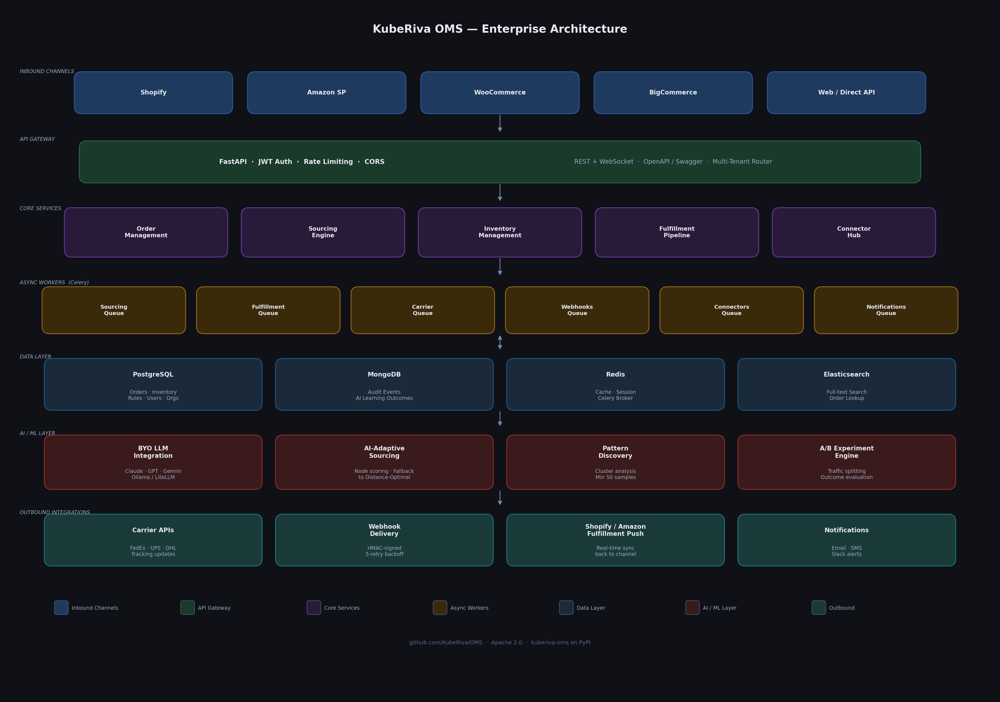
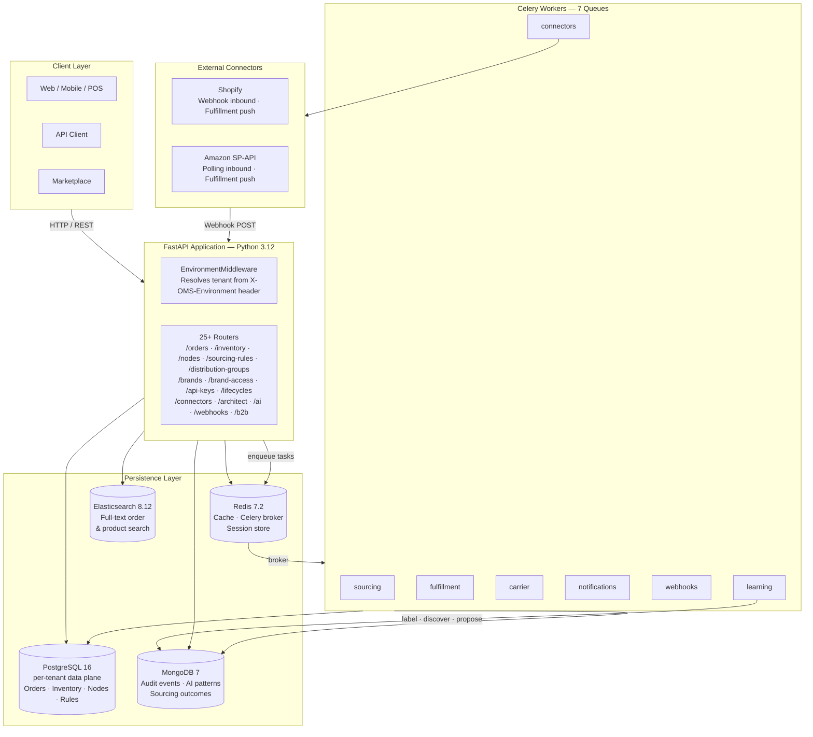
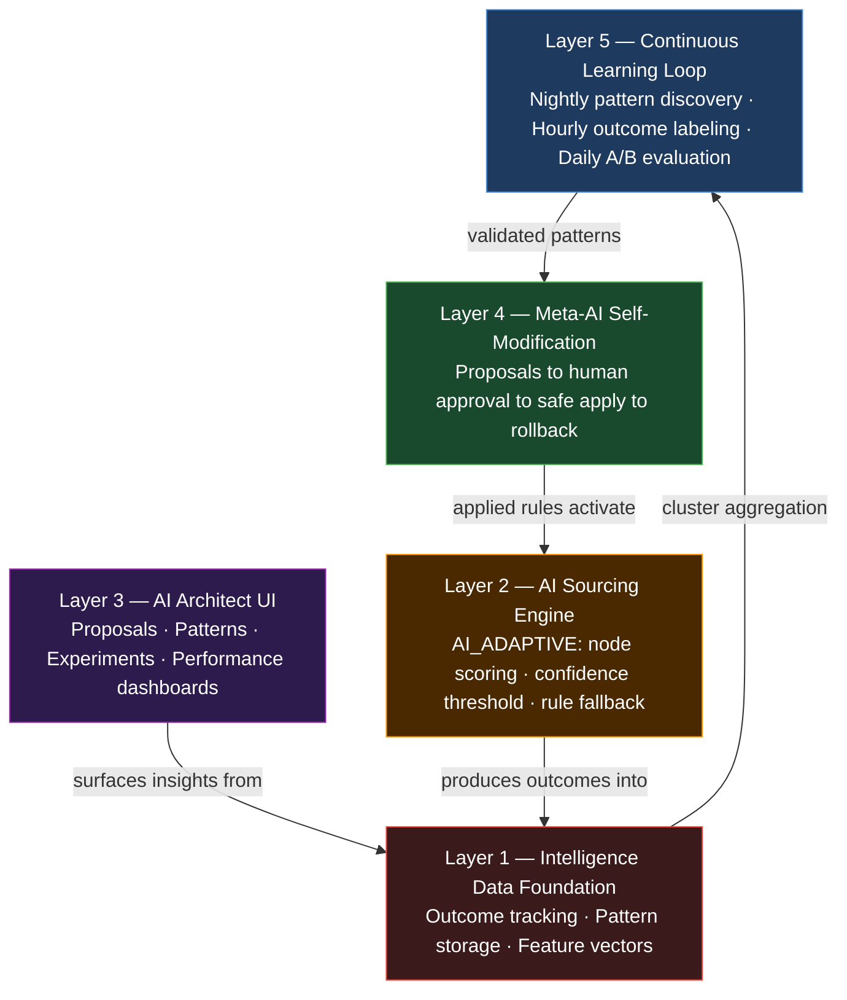
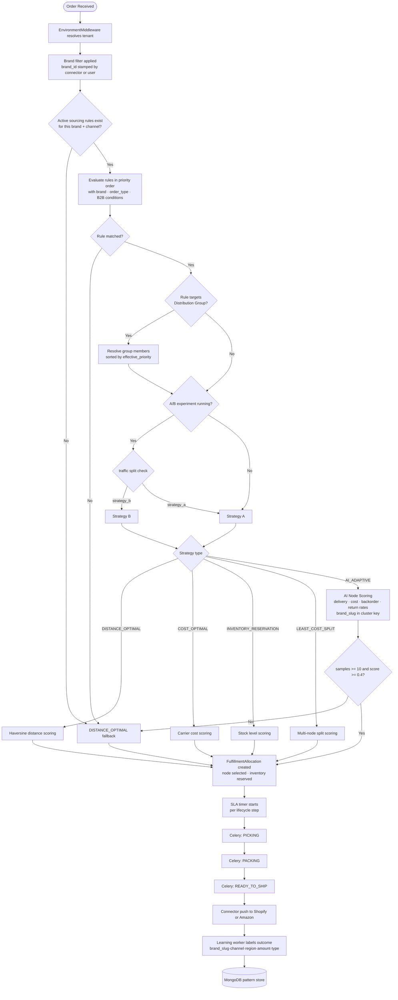
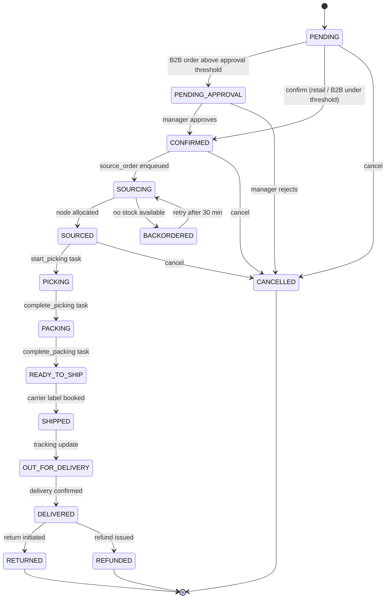

# KubeRiva OMS

**The open-source, AI-native order management system** — self-host the order routing stack that replaces any leading OMS.

[](https://pypi.org/project/kuberiva-oms/)
[](https://github.com/KubeRiva/OMS/actions/workflows/ci.yml)
[](https://github.com/KubeRiva/OMS/actions/workflows/docker-build.yml)
[](LICENSE)
[](https://www.python.org/)
[](https://github.com/KubeRiva/OMS/pkgs/container/oms-api)
[](https://github.com/KubeRiva/OMS/stargazers)
[](https://github.com/KubeRiva/OMS/discussions)

---

> **[Architecture](#1-architecture-overview)** · **[Discussions](https://github.com/KubeRiva/OMS/discussions)** · **[Roadmap](https://github.com/KubeRiva/OMS/projects)** · **[Contributing](CONTRIBUTING.md)**

---

<!-- Add demo GIF here once recorded: order creation → AI sourcing decision → audit trail
     Record with OBS/ScreenToGif: 30s loop, 1200px wide. Save to docs/demo.gif -->
> **Demo GIF coming soon** — [track progress](https://github.com/KubeRiva/OMS/issues)

## What is KubeRiva OMS?

KubeRiva OMS is a **production-grade, async-first order management system** built for mid-market e-commerce teams that have outgrown Shopify's native fulfillment but can't justify pricing for any leading OMS provider.

- **AI-native sourcing** — 7 strategies including `AI_ADAPTIVE` (an LLM scores fulfillment nodes per order using historical delivery rates, cost, and backorder data) with a full outcome-labeling feedback loop. Ships with Claude Haiku by default; [bring your own LLM](#74-bring-your-own-llm)
- **Multi-tenant by default** — each organization gets its own isolated PostgreSQL data-plane database, provisioned automatically
- **Connector ecosystem** — bidirectional Shopify and Amazon SP-API out of the box; pluggable framework for WooCommerce, Magento, FedEx, UPS, and more

---

## Quick Start

### Option A — pip / pipx (recommended)

Requires: Python 3.12+ and Docker Desktop

```bash
# pip
pip install kuberiva-oms

# or pipx (isolated, no environment pollution)
pipx install kuberiva-oms
```

```bash
kuberiva start --seed    # starts all services + loads demo data
```

That's it. KubeRiva OMS pulls the Docker images and starts all 9 services automatically.

| Command | Description |
|---|---|
| `kuberiva start` | Start all services |
| `kuberiva start --seed` | Start + load demo data |
| `kuberiva start --open` | Start + open dashboard in browser |
| `kuberiva stop` | Stop all services |
| `kuberiva restart` | Restart all services |
| `kuberiva restart api` | Restart a single service |
| `kuberiva status` | Show running services and URLs |
| `kuberiva logs` | View logs (all services) |
| `kuberiva logs api --follow` | Stream API logs |
| `kuberiva seed` | Load demo data into a running instance |
| `kuberiva update` | Pull latest images and restart |
| `kuberiva --version` | Show installed version |

---

### Option B — Docker Compose (manual)

Requires: Docker Desktop 4.x (or Docker Engine + Compose v2)

```bash
git clone https://github.com/KubeRiva/OMS.git
cd OMS
cp .env.example .env
docker compose up --build
```

```bash
# Seed demo data
docker compose exec api python scripts/seed.py
```

---

| Service | URL |
|---|---|
| Frontend dashboard | http://localhost:3001 |
| API (OpenAPI docs) | http://localhost:8001/docs |
| Celery Flower | http://localhost:5556 |

Default login: `admin@example.com` / `admin123`

---

## Features

| | |
|---|---|
| **Order lifecycle** | 15-state machine: PENDING → CONFIRMED → SOURCING → SOURCED → PICKING → PACKING → READY_TO_SHIP → SHIPPED → DELIVERED + return/cancel paths |
| **7 sourcing strategies** | DISTANCE_OPTIMAL, COST_OPTIMAL, STORE_NEAREST, INVENTORY_RESERVATION, LEAST_COST_SPLIT, AI_ADAPTIVE, AI_HYBRID |
| **AI learning loop** | Hourly outcome labeling → nightly pattern discovery → daily A/B experiment evaluation → human-approved proposals |
| **Multi-tenant** | Control-plane + per-tenant data-plane PostgreSQL; environment middleware resolves tenant from request header |
| **Multi-brand** | Brand entity with B2C_ONLY / B2B_ONLY / HYBRID tenant modes; brand_id scoping on orders, sourcing rules, and connectors |
| **B2B commerce** | Customer accounts, pricing tiers (BRONZE → PLATINUM), approval gate, credit enforcement, NET-terms invoicing, B2B analytics |
| **Distribution groups** | Named pools of fulfillment nodes; sourcing rules target groups instead of node types; member priority ordering |
| **API key auth** | Machine-to-machine access via `X-API-Key: kr_...`; SHA-256 hashed storage; configurable scopes |
| **SLA monitoring** | Per-step `sla_hours` config; breach detection every 15 min; `order.sla_breach` audit events |
| **Connectors** | Shopify (webhook + fulfillment push via Fulfillment Orders API 2024-07), Amazon SP-API (polling + fulfillment push) |
| **Inventory** | Multi-node stock tracking, adjustments, transfers, reservations across warehouses / stores / dark stores |
| **Webhooks** | HMAC-SHA256 signed, exponential backoff retry, delivery history |
| **Search** | Elasticsearch full-text search across orders and products |
| **Observability** | Prometheus metrics, structured JSON logs, Celery Flower, MongoDB audit trail for every order event |
| **RBAC** | 3-tier: PLATFORM_OWNER > SUPERADMIN > USER; brand-scoped USER access via UserBrandRole |

---

## Connector Ecosystem

| Connector | Status | Direction |
|---|---|---|
| Shopify | ✅ Stable | Webhook inbound + fulfillment push (Fulfillment Orders API 2024-07) |
| Amazon SP-API | ✅ Stable | Polling inbound + fulfillment push |
| WooCommerce | 🗺 Planned v0.3 | |
| Magento | 🗺 Planned v0.3 | |
| BigCommerce | 🗺 Planned | |
| FedEx | 🗺 Planned v0.3 | Label generation + tracking |
| UPS | 🗺 Planned v0.3 | Label generation + tracking |
| DHL | 🗺 Planned v0.3 | Label generation + tracking |

Want a connector that's not listed? [Open a connector request](https://github.com/KubeRiva/OMS/issues/new?template=connector_request.yml).

---

## Tech Stack

| Layer | Technology |
|---|---|
| API | FastAPI 0.111, Python 3.12, Pydantic v2 |
| Primary DB | PostgreSQL 16 (asyncpg) |
| Document DB | MongoDB 7.0 (Motor async) |
| Cache / Queue broker | Redis 7.2 (aioredis) |
| Search | Elasticsearch 8.12 |
| Task queue | Celery 5.4 — 7 queues |
| Frontend | React 18, TypeScript, Vite, TailwindCSS, TanStack Query v5 |
| AI | LLM-agnostic (ships with Claude Haiku `4-5` by default — [swappable](#74-bring-your-own-llm)) |
| Containers | Docker Compose (9 services) |

---

## Contributing

We welcome PRs for bug fixes, new connectors, and features on the [roadmap](https://github.com/KubeRiva/OMS/projects).

See **[CONTRIBUTING.md](CONTRIBUTING.md)** for setup instructions, style guide, and the connector build guide.

Ask questions in **[GitHub Discussions](https://github.com/KubeRiva/OMS/discussions)** before starting a large PR.

---

## License

Apache 2.0 — see [LICENSE](LICENSE).

---

## Full Documentation

The sections below cover the complete system internals.

---

## Table of Contents

1. [Architecture Overview](#1-architecture-overview)
2. [Directory Structure](#2-directory-structure)
3. [Tech Stack](#3-tech-stack)
4. [Data Models](#4-data-models)
   - [PostgreSQL Models](#41-postgresql-models)
   - [MongoDB Collections](#42-mongodb-collections)
   - [Redis Key Schema](#43-redis-key-schema)
   - [Elasticsearch Indexes](#44-elasticsearch-indexes)
5. [API Reference](#5-api-reference)
   - [Orders](#51-orders-router)
   - [Inventory](#52-inventory-router)
   - [Fulfillment Nodes](#53-fulfillment-nodes-router)
   - [Sourcing Rules](#54-sourcing-rules-router)
   - [Distribution Groups](#55-distribution-groups-router)
   - [Search](#56-search-router)
   - [Analytics](#57-analytics-router)
   - [Webhooks](#58-webhooks-router)
   - [Connectors](#59-connectors-router)
   - [AI Architect](#510-ai-architect-router)
   - [Brands](#511-brands-router)
   - [API Keys](#512-api-keys-router)
   - [Brand Access](#513-brand-access-router)
   - [Lifecycles](#514-lifecycles-router)
6. [Sourcing Rules Engine](#6-sourcing-rules-engine)
7. [AI-Native Architecture](#7-ai-native-architecture)
8. [Fulfillment Pipeline](#8-fulfillment-pipeline)
9. [Celery Workers](#9-celery-workers)
10. [Webhook System](#10-webhook-system)
11. [Connector System](#11-connector-system)
12. [Configuration](#12-configuration)
13. [Running the System](#13-running-the-system)
14. [End-to-End Order Flow](#14-end-to-end-order-flow)
15. [B2B Commerce](#15-b2b-commerce)
16. [Brand Entity](#16-brand-entity)
17. [Distribution Groups](#17-distribution-groups)
18. [Lifecycle Pipeline Types](#18-lifecycle-pipeline-types)
19. [API Keys](#19-api-keys)
20. [Brand-Scoped User Access](#20-brand-scoped-user-access)
21. [SLA Breach Detection](#21-sla-breach-detection)
22. [Worker Reliability](#22-worker-reliability)
23. [Platform Owner Role](#23-platform-owner-role)
24. [Node CRUD UI](#24-node-crud-ui)
25. [End-to-End Test Suite](#25-end-to-end-test-suite)

---

## 1. Architecture Overview



### System Architecture



---

### AI-Native 5-Layer Architecture



---

### AI Sourcing Decision Flow



---

### Order Lifecycle



---

### Request Lifecycle

1. Client POSTs to `POST /orders` — Pydantic v2 validates, written to **PostgreSQL**, indexed in **Elasticsearch**
2. `order.created` event written to **MongoDB** audit log
3. `source_order` task enqueued on **Redis**-backed `sourcing` Celery queue
4. Sourcing engine evaluates rules → selects strategy → may invoke `AI_ADAPTIVE` node scoring
5. `FulfillmentAllocation` created → pipeline flows: `sourcing → fulfillment → carrier → notifications → webhooks`
6. `learning` worker labels delivery outcome → feeds pattern store → triggers nightly discovery

---

## 2. Directory Structure

```
OMS/
├── Dockerfile                      # Multi-stage Python 3.12 image
├── docker-compose.yml              # All 8 services
├── requirements.txt                # All Python dependencies
├── .env                            # Local environment variables
│
├── app/
│   ├── main.py                     # FastAPI app, lifespan, router registration
│   ├── config.py                   # Pydantic Settings (reads .env)
│   │
│   ├── database/
│   │   ├── postgres.py             # Async SQLAlchemy engine + session factory
│   │   ├── mongodb.py              # Motor async client + index creation
│   │   ├── redis_client.py         # aioredis pool + cache helpers
│   │   └── elasticsearch_client.py # Async ES client + index mapping creation
│   │
│   ├── models/postgres/
│   │   ├── order_models.py         # Order, OrderItem, FulfillmentAllocation, Shipment,
│   │   │                           #   WebhookEndpoint, WebhookEvent + all enums
│   │   ├── inventory_models.py     # InventoryItem, InventoryAdjustment, InventoryReservation
│   │   ├── node_models.py          # FulfillmentNode + NodeType/NodeStatus enums
│   │   ├── sourcing_rule_models.py # SourcingRule + SourcingStrategy/ConditionOperator enums
│   │   ├── connector_models.py     # Connector, ConnectorEvent + ConnectorType/Status/Direction enums
│   │   └── ai_models.py            # AIProposal, CustomAttributeDefinition, UIWidget,
│   │                               #   AIExperiment, SourcingOutcomeLabel + enums
│   │
│   ├── schemas/
│   │   ├── common.py               # PaginationParams, PaginatedResponse, MessageResponse
│   │   ├── orders.py               # OrderCreate/Update/Response, OrderItemCreate, etc.
│   │   ├── inventory.py            # InventoryItemCreate/Response, AdjustmentCreate, etc.
│   │   ├── nodes.py                # NodeCreate/Update/Response
│   │   ├── sourcing_rules.py       # SourcingRuleCreate/Response, SourcingCondition, SourcingResult
│   │   ├── search.py               # OrderSearchRequest/Response, SearchHit
│   │   ├── analytics.py            # DashboardSummary, ChannelBreakdown, etc.
│   │   ├── webhooks.py             # WebhookEndpointCreate/Response, WebhookEventResponse
│   │   └── connectors.py           # ConnectorCreate/Update/Response, ConnectorEventResponse
│   │
│   ├── routers/
│   │   ├── orders.py               # 9 endpoints — full order CRUD + status transitions
│   │   ├── inventory.py            # 8 endpoints — stock management + transfers
│   │   ├── nodes.py                # 6 endpoints — node CRUD + capacity
│   │   ├── sourcing_rules.py       # 7 endpoints — rule CRUD + manual evaluation
│   │   ├── search.py               # 3 endpoints — order + product full-text search
│   │   ├── analytics.py            # 3 endpoints — dashboard + volume + inventory summary
│   │   ├── webhooks.py             # 8 endpoints — endpoint + event management
│   │   ├── connectors.py           # 10 endpoints — CRUD + webhook receiver + event log
│   │   └── architect.py            # 20+ endpoints — proposals, patterns, experiments,
│   │                               #   node performance, AI sourcing comparison
│   │
│   ├── services/
│   │   ├── sourcing_engine.py      # Intelligence core (see §6) + AI_ADAPTIVE + experiment routing
│   │   ├── ai_sourcing.py          # AISourcingAdvisor — KubeAI node scoring
│   │   ├── pattern_discovery.py    # PatternDiscoveryService — nightly cluster aggregation + proposals
│   │   ├── schema_evolution.py     # SchemaEvolutionEngine — safe additive schema changes
│   │   ├── webhook.py              # HMAC-SHA256 signed delivery
│   │   └── connectors/
│   │       ├── __init__.py         # Package init
│   │       ├── base.py             # Abstract BaseConnector (validate, normalize, push)
│   │       ├── shopify.py          # Shopify bidirectional implementation
│   │       └── registry.py         # ConnectorType → class mapping
│   │
│   └── workers/
│       ├── celery_app.py           # Celery factory + 7 queues + beat schedule
│       ├── sourcing.py             # source_order task (writes sourcing_outcomes to MongoDB)
│       ├── fulfillment.py          # start_picking, complete_packing, reset_node_daily_counters
│       ├── carrier.py              # book_shipment, simulate_delivery, sync_all_tracking
│       ├── notifications.py        # Email/SMS notification tasks
│       ├── webhooks.py             # dispatch_webhook, retry_failed_webhooks
│       ├── connectors.py           # sync_fulfillment_to_connector task
│       └── learning.py             # label_sourcing_outcomes, discover_patterns,
│                                   #   update_node_performance, evaluate_ai_experiments
│
├── scripts/
│   └── seed.py                     # Seeds all 4 databases with realistic data
│
└── tests/
    └── test_imports.py             # 13 import + unit tests (all passing)
```

---

## 3. Tech Stack

| Layer | Technology | Purpose |
|---|---|---|
| API framework | FastAPI 0.111 + Uvicorn | Async REST API, OpenAPI docs |
| ORM | SQLAlchemy 2.0 (async) | PostgreSQL ORM with asyncpg driver |
| Primary DB | PostgreSQL 16 | Orders, inventory, nodes, sourcing rules, AI proposals |
| Document DB | MongoDB 7 (Motor) | Event log, product catalog, sourcing outcomes, patterns |
| Cache / Queue | Redis 7.2 | Celery broker/backend, cache, rate-limiting |
| Search | Elasticsearch 8.12 | Full-text order and product search |
| Task queue | Celery 5.4 + Flower | Async pipeline workers, beat scheduler |
| AI / LLM | LLM-agnostic — default: `claude-haiku-4-5-20251001` (Anthropic) | AI node scoring, NL → proposals |
| Validation | Pydantic v2 | Request/response schemas, settings |
| Containers | Docker Compose | All 8 services in one command |
| HMAC signing | hashlib + hmac (stdlib) | Webhook payload integrity |
| Geo math | haversine (stdlib math) | Sourcing distance calculations |

---

## 4. Data Models

### 4.1 PostgreSQL Models

#### `fulfillment_nodes`
| Column | Type | Description |
|---|---|---|
| `id` | UUID PK | Node identifier |
| `code` | VARCHAR(50) UNIQUE | Short code e.g. `DC-EAST` |
| `name` | VARCHAR(200) | Display name |
| `node_type` | ENUM | `DISTRIBUTION_CENTER`, `RETAIL_STORE`, `DARK_STORE`, `WAREHOUSE`, `PICKUP_POINT` |
| `status` | ENUM | `ACTIVE`, `INACTIVE`, `MAINTENANCE`, `CLOSED` |
| `latitude/longitude` | FLOAT | Geographic coordinates |
| `can_ship/pickup/curbside/same_day` | BOOL | Capability flags |
| `daily_order_capacity` | INT | Max orders per day |
| `current_daily_orders` | INT | Reset to 0 at midnight by Celery beat |
| `shipping_cost_multiplier` | FLOAT | Relative cost weight for sourcing |

#### `orders`
| Column | Type | Description |
|---|---|---|
| `id` | UUID PK | Order identifier |
| `order_number` | VARCHAR(50) UNIQUE | Human-readable e.g. `ORD-20240101-ABC123` |
| `channel` | ENUM | `WEB`, `MOBILE`, `POS`, `API`, `MARKETPLACE` |
| `fulfillment_type` | ENUM | `SHIP_TO_HOME`, `STORE_PICKUP`, `SHIP_FROM_STORE`, `CURBSIDE_PICKUP`, `SAME_DAY_DELIVERY` |
| `status` | ENUM | 15-state machine (see §7) |
| `total_amount` | NUMERIC(12,2) | Order total |
| `shipping_latitude/longitude` | FLOAT | Customer location for sourcing |
| `pickup_node_id` | UUID FK | For BOPIS/curbside orders |
| `sourcing_rule_id` | UUID FK | Which rule was applied |

#### `order_items`
Line items linked to an order. Tracks `quantity_fulfilled` as allocations are shipped.

#### `fulfillment_allocations`
Bridges an order item to a specific fulfillment node. One order can have multiple allocations (split fulfillment). Tracks the full picking → packing → shipping timeline.

#### `shipments`
One per allocation (or per order for simple cases). Stores carrier, tracking number, label URL, and a JSON array of tracking events.

#### `inventory_items`
Per-node, per-SKU stock levels with three counters:
- `quantity_on_hand` — physical stock
- `quantity_reserved` — soft-reserved by active allocations
- `quantity_available = on_hand - reserved` — what sourcing can use

#### `inventory_adjustments`
Immutable audit log of every stock change with before/after quantities.

#### `sourcing_rules`
Configurable rules evaluated in `priority` order (ascending). Each rule has:
- `conditions` — JSON array of `{field, operator, value}` tuples
- `strategy` — which algorithm to apply (`DISTANCE_OPTIMAL`, `COST_OPTIMAL`, `STORE_NEAREST`, `INVENTORY_RESERVATION`, `LEAST_COST_SPLIT`, `AI_ADAPTIVE`, `AI_HYBRID`)
- `allowed_node_types`, `required_capabilities` — node filters
- `max_split_nodes`, `cost_weight`, `distance_weight` — algorithm parameters

#### `webhook_endpoints` + `webhook_events`
Persistent HMAC webhook delivery with retry state machine.

#### `ai_proposals`
All AI-proposed system changes awaiting human review. Lifecycle: `PENDING → APPROVED → APPLIED` (or `REJECTED` / `ROLLED_BACK`). Nothing is applied without explicit admin approval.

| Column | Type | Description |
|---|---|---|
| `id` | UUID PK | Proposal identifier |
| `proposal_type` | VARCHAR | `sourcing_rule`, `custom_attribute`, `schema_migration`, `ui_widget`, `sourcing_experiment` |
| `title` | VARCHAR | Short human-readable title |
| `description` | TEXT | Plain-language explanation |
| `rationale` | TEXT | Data evidence (scores, sample counts, improvement %) |
| `confidence_score` | FLOAT | AI confidence 0–1 |
| `proposal_data` | JSONB | The exact change payload to apply |
| `status` | VARCHAR | `pending`, `approved`, `rejected`, `applied`, `rolled_back` |
| `rollback_data` | JSONB | Data needed to undo the applied change |
| `generated_by` | VARCHAR | Source: `learning_worker/pattern_discovery`, chat session ID, etc. |

#### `ai_experiments`
A/B tests between two sourcing strategies. Traffic is split at the sourcing worker level (random assignment per order).

| Column | Type | Description |
|---|---|---|
| `id` | UUID PK | Experiment identifier |
| `name` | VARCHAR | Display name |
| `strategy_a` | VARCHAR | Control strategy (e.g. `DISTANCE_OPTIMAL`) |
| `strategy_b` | VARCHAR | Treatment strategy (e.g. `AI_ADAPTIVE`) |
| `traffic_split_pct` | FLOAT | % of qualifying orders routed to `strategy_b` (1–50) |
| `filter_conditions` | JSONB | Which orders qualify (channel, fulfillment_type, region, amount range) |
| `status` | VARCHAR | `running`, `paused`, `completed` |
| `winner` | VARCHAR | Set when experiment concludes |
| `results` | JSONB | Computed per-arm outcome comparison |

#### `custom_attribute_definitions`
Dynamic schema extensions — adds new fields to orders, products, nodes without DDL changes (uses existing `metadata_` JSONB columns).

#### `sourcing_outcome_labels`
PostgreSQL mirror of labeled `sourcing_outcomes` documents for fast analytical queries.

### 4.2 MongoDB Collections

| Collection | Purpose |
|---|---|
| `order_events` | Append-only audit trail for every order state change |
| `product_catalog` | Rich product data (images, attributes, rich descriptions) |
| `webhook_deliveries` | Delivery attempt history per event |
| `notifications` | Email/SMS notification log |
| `sourcing_outcomes` | Per-allocation sourcing decision snapshot + delivery outcome labels |
| `sourcing_patterns` | Aggregated node performance per order-feature cluster (channel\|region\|amount\|type) |
| `node_performance_metrics` | Rolling 7-day and 30-day node stats (avg score, delivery hours, backorder rate) |

**`sourcing_outcomes` document example:**
```json
{
  "order_id": "uuid",
  "allocation_id": "uuid",
  "node_id": "uuid",
  "node_name": "DC-EAST",
  "sku": "SKU-WIDGET-A",
  "strategy_used": "AI_ADAPTIVE",
  "cluster_key": "WEB|NY|100-250|SHIP_TO_HOME",
  "channel": "WEB",
  "region": "NY",
  "amount_bucket": "100-250",
  "fulfillment_type": "SHIP_TO_HOME",
  "sourcing_score": 0.85,
  "predicted_cost": 8.50,
  "predicted_distance_miles": 13.5,
  "ai_score": 0.91,
  "ai_reasoning": "DC-EAST has 94% on-time delivery for NY in last 7 days",
  "experiment_id": "uuid-or-null",
  "sourced_at": "2024-03-10T14:22:00Z",
  "actual_delivery_hours": 24.5,
  "actual_cost": 9.10,
  "cost_variance_pct": 7.1,
  "was_backordered": false,
  "was_returned": false,
  "outcome_score": 0.92,
  "labeled_at": "2024-03-12T09:00:00Z"
}
```

**Outcome score formula:**
```
outcome_score = (
  0.4 × delivery_score     # 1.0 if ≤24h, 0.5 if ≤48h, 0.0 if >72h
  0.3 × cost_score          # 1.0 if variance ≤5%, 0.0 if >25%
  0.2 × (1 - backordered)   # 1.0 if no backorder
  0.1 × (1 - returned)      # 1.0 if not returned
)
```

Indexes: order_events is indexed on `(order_id, timestamp)` and `event_type`. product_catalog has a text index on `name + description` for full-text search. sourcing_outcomes indexed on `(cluster_key, strategy_used, outcome_score)` and `(order_id, allocation_id)`.

### 4.3 Redis Key Schema

| Key Pattern | Type | TTL | Purpose |
|---|---|---|---|
| `oms:version` | STRING | 24h | Current version |
| `oms:stats` | HASH | — | Aggregate counters |
| `oms:active_strategies` | STRING | 1h | Cached strategy list |
| `celery:*` | Various | — | Celery broker/result state |

### 4.4 Elasticsearch Indexes

#### `oms_orders`
Optimized for order search. Fields: `order_number` (keyword), `customer_name` (text), `channel`, `status`, `fulfillment_type`, `total_amount`, `created_at`, `tags`, nested `line_items`.

#### `oms_products`
Product catalog search. Fields: `sku` (keyword), `name` (text), `description` (text), `category` (keyword), `price` (float).

---

## 5. API Reference

All endpoints are documented at `http://localhost:8001/docs` (Swagger UI) and `http://localhost:8001/redoc`.

### 5.1 Orders Router (`/orders`)

| Method | Path | Description |
|---|---|---|
| `POST` | `/orders/` | Create new order (triggers sourcing) |
| `GET` | `/orders/` | List orders with filters (status, channel, date range, email) |
| `GET` | `/orders/{order_id}` | Get single order with all relationships |
| `GET` | `/orders/number/{order_number}` | Get order by order number |
| `PATCH` | `/orders/{order_id}/status` | Transition order status |
| `POST` | `/orders/{order_id}/cancel` | Cancel an order |
| `GET` | `/orders/{order_id}/events` | Get MongoDB audit trail |

**Create Order payload example:**
```json
{
  "channel": "WEB",
  "fulfillment_type": "SHIP_TO_HOME",
  "customer_email": "alice@example.com",
  "customer_name": "Alice Smith",
  "line_items": [
    {
      "sku": "SKU-WIDGET-A",
      "product_name": "Premium Widget A",
      "quantity": 2,
      "unit_price": 29.99
    }
  ],
  "shipping_address": {
    "address1": "123 Main St",
    "city": "New York",
    "state": "NY",
    "postal_code": "10001",
    "latitude": 40.7484,
    "longitude": -73.9967
  }
}
```

### 5.2 Inventory Router (`/inventory`)

| Method | Path | Description |
|---|---|---|
| `POST` | `/inventory/` | Create inventory item for a node/SKU |
| `GET` | `/inventory/` | List inventory (filter by node, SKU, low-stock) |
| `GET` | `/inventory/sku/{sku}` | All node stock for a specific SKU |
| `GET` | `/inventory/products` | Aggregated product list grouped by SKU (search, node, low-stock filters) |
| `PATCH` | `/inventory/products/{sku}` | Update product-level attributes for all nodes at once |
| `GET` | `/inventory/{item_id}` | Single inventory item |
| `PATCH` | `/inventory/{item_id}` | Update item metadata |
| `POST` | `/inventory/{item_id}/adjust` | Apply stock adjustment (reason must be valid enum: RECEIVED, RETURNED, DAMAGED, CYCLE_COUNT, CORRECTION, SOLD, etc.) |
| `POST` | `/inventory/check-availability` | Bulk availability check across all nodes |
| `POST` | `/inventory/transfer` | Transfer stock between nodes |

**Adjustment reasons (enum):** `RECEIVED`, `SOLD`, `RETURNED`, `DAMAGED`, `CYCLE_COUNT`, `TRANSFER_IN`, `TRANSFER_OUT`, `RESERVED`, `RESERVATION_RELEASED`, `CORRECTION`

### 5.3 Fulfillment Nodes Router (`/nodes`)

| Method | Path | Description |
|---|---|---|
| `POST` | `/nodes/` | Register a new DC or store |
| `GET` | `/nodes/` | List nodes (filter by type, status, capabilities) |
| `GET` | `/nodes/{node_id}` | Get node details |
| `PATCH` | `/nodes/{node_id}` | Update node configuration |
| `DELETE` | `/nodes/{node_id}` | Deactivate node (soft delete) |
| `GET` | `/nodes/{node_id}/capacity` | Get daily capacity utilization |

### 5.4 Sourcing Rules Router (`/sourcing-rules`)

| Method | Path | Description |
|---|---|---|
| `POST` | `/sourcing-rules/` | Create new rule |
| `GET` | `/sourcing-rules/` | List rules sorted by priority |
| `GET` | `/sourcing-rules/{rule_id}` | Get rule details |
| `PATCH` | `/sourcing-rules/{rule_id}` | Update rule |
| `DELETE` | `/sourcing-rules/{rule_id}` | Delete rule |
| `POST` | `/sourcing-rules/{rule_id}/toggle` | Enable/disable rule |
| `POST` | `/sourcing-rules/evaluate` | Manually run sourcing for an order |

### 5.5 Distribution Groups Router (`/distribution-groups`)

| Method | Path | Description |
|---|---|---|
| `POST` | `/distribution-groups/` | Create a new group |
| `GET` | `/distribution-groups/` | List groups (filter by active, brand) |
| `GET` | `/distribution-groups/{id}` | Get group with members |
| `PATCH` | `/distribution-groups/{id}` | Update group name / description |
| `DELETE` | `/distribution-groups/{id}` | Delete group |
| `POST` | `/distribution-groups/{id}/members` | Add a node to the group |
| `DELETE` | `/distribution-groups/{id}/members/{member_id}` | Remove a member |

### 5.6 Search Router (`/search`)

| Method | Path | Description |
|---|---|---|
| `POST` | `/search/orders` | Full-text order search with filters |
| `GET` | `/search/orders` | GET-style order search (query params) |
| `POST` | `/search/products` | Full-text product search |

Supports: fuzzy matching, multi-field search, date/amount range filters, pagination, sort order.

### 5.7 Analytics Router (`/analytics`)

| Method | Path | Description |
|---|---|---|
| `GET` | `/analytics/dashboard` | Full KPI dashboard summary |
| `GET` | `/analytics/orders/volume` | Daily order volume over N days |
| `GET` | `/analytics/inventory/summary` | Aggregate inventory health metrics |

### 5.8 Webhooks Router (`/webhooks`)

| Method | Path | Description |
|---|---|---|
| `POST` | `/webhooks/endpoints` | Register webhook endpoint |
| `GET` | `/webhooks/endpoints` | List endpoints |
| `GET` | `/webhooks/endpoints/{id}` | Get endpoint |
| `PATCH` | `/webhooks/endpoints/{id}` | Update endpoint |
| `DELETE` | `/webhooks/endpoints/{id}` | Delete endpoint |
| `POST` | `/webhooks/endpoints/{id}/test` | Send test event |
| `GET` | `/webhooks/events` | List delivery events |
| `POST` | `/webhooks/events/{id}/retry` | Retry failed event |

### 5.9 Connectors Router (`/connectors`)

Superadmin-only CRUD for integration connectors (except the public webhook receiver).

| Method | Path | Auth | Description |
|---|---|---|---|
| `POST` | `/connectors/` | Superadmin | Create a new connector |
| `GET` | `/connectors/` | Superadmin | List connectors (filter by status) |
| `GET` | `/connectors/{id}` | Superadmin | Get single connector |
| `PATCH` | `/connectors/{id}` | Superadmin | Update connector config |
| `DELETE` | `/connectors/{id}` | Superadmin | Delete connector |
| `POST` | `/connectors/{id}/toggle` | Superadmin | Enable / disable connector |
| `POST` | `/connectors/{id}/test` | Superadmin | Test API connection to the platform |
| `GET` | `/connectors/{id}/events` | Superadmin | Paginated inbound/outbound event log |
| `POST` | `/connectors/generate-secret` | Superadmin | Generate a secure webhook secret |
| `POST` | `/connectors/{id}/webhook` | **Public** | HMAC-validated inbound webhook receiver |

**Sensitive config fields** (`access_token`, `webhook_secret`, `api_key`, etc.) are always masked as `***` in API responses.

### 5.10 AI Architect Router (`/architect`)

Superadmin-only. All endpoints require `requireSuperadmin` authentication.

**Proposals**

| Method | Path | Description |
|---|---|---|
| `GET` | `/architect/proposals` | List proposals (filter by `status`, `proposal_type`) |
| `GET` | `/architect/proposals/{id}` | Get proposal detail with full rationale |
| `POST` | `/architect/proposals/{id}/approve` | Mark proposal as approved |
| `POST` | `/architect/proposals/{id}/reject` | Reject with reason |
| `POST` | `/architect/proposals/{id}/apply` | Execute an approved proposal (safe, additive only) |
| `POST` | `/architect/proposals/{id}/rollback` | Undo an applied proposal |

**Patterns & Performance**

| Method | Path | Description |
|---|---|---|
| `GET` | `/architect/patterns` | List discovered order-feature clusters with node rankings |
| `GET` | `/architect/node-performance` | Rolling node stats (`?period_days=7` or `30`) |
| `GET` | `/architect/ai-sourcing/performance` | AI vs rule-based outcome comparison |

**A/B Experiments**

| Method | Path | Description |
|---|---|---|
| `GET` | `/architect/experiments` | List experiments (filter by status) |
| `POST` | `/architect/experiments` | Create new experiment |
| `POST` | `/architect/experiments/{id}/pause` | Pause a running experiment |
| `POST` | `/architect/experiments/{id}/resume` | Resume a paused experiment |
| `GET` | `/architect/experiments/{id}/results` | Live per-arm outcome aggregation |

### 5.11 Brands Router (`/brands`)

Superadmin-only CRUD for brand entities.

| Method | Path | Description |
|---|---|---|
| `POST` | `/brands/` | Create a new brand |
| `GET` | `/brands/` | List brands (filter by active, tenant_mode) |
| `GET` | `/brands/{id}` | Get brand |
| `PATCH` | `/brands/{id}` | Update brand |
| `POST` | `/brands/{id}/toggle` | Activate / deactivate brand |

### 5.12 API Keys Router (`/api-keys`)

| Method | Path | Auth | Description |
|---|---|---|---|
| `POST` | `/api-keys/` | Superadmin | Create key — returns plaintext `key` once |
| `GET` | `/api-keys/` | Superadmin | List keys (prefix only; secret never re-shown) |
| `GET` | `/api-keys/{id}` | Superadmin | Get key metadata |
| `PATCH` | `/api-keys/{id}` | Superadmin | Update name / scopes / expiry |
| `DELETE` | `/api-keys/{id}` | Superadmin | Revoke key |

### 5.13 Brand Access Router (`/brand-access`)

| Method | Path | Auth | Description |
|---|---|---|---|
| `POST` | `/brand-access/` | Superadmin | Assign a user to a brand with a role |
| `GET` | `/brand-access/` | Superadmin | List all user-brand role assignments |
| `PATCH` | `/brand-access/{id}` | Superadmin | Change role |
| `DELETE` | `/brand-access/{id}` | Superadmin | Remove assignment |

### 5.14 Lifecycles Router (`/lifecycles`)

| Method | Path | Description |
|---|---|---|
| `POST` | `/lifecycles/` | Create a lifecycle pipeline definition |
| `GET` | `/lifecycles/` | List lifecycles |
| `GET` | `/lifecycles/{id}` | Get lifecycle with steps |
| `PATCH` | `/lifecycles/{id}` | Update lifecycle |
| `DELETE` | `/lifecycles/{id}` | Delete lifecycle |
| `POST` | `/lifecycles/resolve` | Resolve the best lifecycle for a given order context |

---

## 6. Sourcing Rules Engine

**File:** `app/services/sourcing_engine.py`

The engine is the intelligence core. It runs every time an order needs to be sourced.

### 6.1 Processing Pipeline

```
Order
  │
  ▼
RuleSelector ──► Find highest-priority SourcingRule where ALL conditions match
  │
  ▼
NodeFilter ──► Apply: node type filter, capability filter, distance filter,
  │            capacity filter, excluded node list
  ▼
InventoryLoader ──► Load quantity_available per (node, SKU) in one query
  │
  ▼
NodeScorer ──► Compute normalized score per strategy
  │
  ▼
AllocationDecider ──► Single-node or split allocation
  │
  ▼
Persist ──► Write FulfillmentAllocation rows + reserve inventory
```

### 6.2 Seven Sourcing Strategies

#### `DISTANCE_OPTIMAL`
Score = `distance_norm × 0.7 + inventory_norm × 0.3`

Picks the node closest to the customer's shipping address. Uses Haversine great-circle distance. Falls back to split if no single node can fulfill all items.

#### `COST_OPTIMAL`
Score = `cost_norm × cost_weight + distance_norm × distance_weight`

Minimizes total estimated shipping cost (`base_rate + per_km_rate × distance × node_multiplier`). Weights are configurable per rule (default 50/50).

#### `STORE_NEAREST`
Identical scoring to DISTANCE_OPTIMAL but the node filter pre-restricts to `RETAIL_STORE` and `DARK_STORE` types. Used for same-day delivery and local fulfillment.

#### `INVENTORY_RESERVATION`
Score = `inventory_norm × 0.8 + distance_norm × 0.2`

Prefers nodes with the deepest available stock — reduces the chance of a reservation failing downstream. Useful for high-velocity SKUs.

#### `LEAST_COST_SPLIT`
Greedy algorithm that assigns each SKU to the cheapest eligible node:

1. Sort SKUs by fulfillability (hardest first = fewest nodes with stock)
2. For each SKU, iterate nodes in score order
3. Allocate as much as possible from each node until the full quantity is covered
4. Enforces `max_split_nodes` limit

#### `AI_ADAPTIVE`
Uses an LLM (default: `claude-haiku-4-5-20251001`) to score candidate nodes based on historical patterns and rolling performance data. The LLM receives the order context (channel, region, amount, fulfillment type), the top-3 matching historical pattern clusters, 7-day node performance metrics, and a list of candidate nodes. It responds with a JSON array of `{node_id, score, reason}`.

**Fallback to `DISTANCE_OPTIMAL` when:**
- Best matching pattern has < 10 samples
- LLM API call fails or returns invalid JSON
- Maximum AI score across all candidates < 0.4

**Final score blend:** `0.6 × ai_score + 0.4 × rule_score`

#### `AI_HYBRID`
Identical to `AI_ADAPTIVE` but uses the blended `rule_score` more aggressively. Intended for transitional rollouts where full AI trust is not yet established.

### 6.3 Condition Operators

| Operator | Example |
|---|---|
| `EQUALS` | `channel == WEB` |
| `NOT_EQUALS` | `channel != MARKETPLACE` |
| `GREATER_THAN` | `total_amount > 200` |
| `LESS_THAN` | `total_amount < 50` |
| `GREATER_THAN_OR_EQUAL` | `total_amount >= 100` |
| `LESS_THAN_OR_EQUAL` | `total_amount <= 500` |
| `IN` | `shipping_state IN [NY, NJ, CT]` |
| `NOT_IN` | `channel NOT IN [POS]` |
| `CONTAINS` | `customer_email CONTAINS example.com` |
| `STARTS_WITH` | `shipping_state STARTS_WITH N` |

### 6.4 Haversine Distance Formula

```python
def haversine_km(lat1, lon1, lat2, lon2):
    R = 6371.0  # Earth radius km
    φ1, φ2 = radians(lat1), radians(lat2)
    Δφ = radians(lat2 - lat1)
    Δλ = radians(lon2 - lon1)
    a = sin(Δφ/2)**2 + cos(φ1)*cos(φ2)*sin(Δλ/2)**2
    return R * 2 * asin(sqrt(a))
```

Accuracy: ±0.5% vs actual road distance. Sufficient for DC-level sourcing decisions.

---

## 7. AI-Native Architecture

### 7.1 Overview

The AI layer is fully additive — it extends the existing rule engine without replacing it. All AI decisions are audited, all proposals require human approval, and every strategy has a deterministic fallback.

**Design Principles:**
- **Additive-only** — no existing data or functionality is ever modified or deleted
- **Human-gated** — proposals are created as `PENDING`; nothing applies without admin approval
- **Fallback-safe** — every AI path falls back to `DISTANCE_OPTIMAL` on failure
- **Fully audited** — every sourcing decision writes a `sourcing_outcomes` document
- **Evidence-backed** — proposals include data rationale (sample counts, score improvements)

### 7.2 Intelligence Data Foundation

Every time an order is sourced, the `sourcing` Celery worker writes a `sourcing_outcomes` document to MongoDB capturing the full decision context: which strategy was used, AI score + reasoning, predicted cost and distance, and whether an A/B experiment was active.

When an order reaches `DELIVERED`, the `label_sourcing_outcomes` task (runs hourly) computes an `outcome_score` from actual delivery time, cost variance, backorder flag, and return flag. This creates a labeled training example.

**Cluster key** = `channel|region|amount_bucket|fulfillment_type`
Example: `WEB|NY|100-250|SHIP_TO_HOME`

### 7.3 AI Sourcing (AI_ADAPTIVE)

`AISourcingAdvisor` (in `app/services/ai_sourcing.py`) is called by the sourcing engine when `strategy == AI_ADAPTIVE`. It:

1. Extracts order features and computes the cluster key
2. Finds the top-3 matching `sourcing_patterns` from MongoDB
3. Loads rolling 7-day `node_performance_metrics` for each candidate
4. Sends a structured prompt to the configured LLM with order context + patterns + node metrics
5. Parses the JSON response: `[{node_id, score, reason}]`
6. Blends AI scores with rule-based scores: `0.6 × ai + 0.4 × rule`
7. Falls back to `DISTANCE_OPTIMAL` on any error or low-confidence result

### 7.4 Bring Your Own LLM

KubeRiva OMS ships with **Anthropic Claude** as the default LLM provider. You are free to swap in any LLM that fits your enterprise agreements or infrastructure constraints. The LLM is used in three places:

| File | Purpose | Default model |
|---|---|---|
| `app/services/ai_sourcing.py` | `AI_ADAPTIVE` node scoring (structured JSON output) | `claude-haiku-4-5-20251001` |
| `app/routers/ai.py` | AI Assistant chat interface (streaming) | `claude-sonnet-4-6` |
| `app/routers/ops.py` | Ops assistant / natural-language commands (streaming) | `claude-haiku-4-5-20251001` |

**To swap the LLM:**

1. Replace the `anthropic.AsyncAnthropic` client instantiation in each file above with your provider's SDK or an OpenAI-compatible client pointed at your endpoint.
2. Update `ANTHROPIC_API_KEY` in your `.env` to whatever key variable your provider requires.
3. Adjust the `model=` string to match your provider's model identifier.

**Community tip:** [LiteLLM](https://github.com/BerriAI/litellm) provides a single unified interface to Anthropic, OpenAI, Azure, Ollama, vLLM, Bedrock, Groq, and 100+ other providers. Adding it lets you switch providers by changing a single env var without touching application code. A PR wiring LiteLLM into the three call sites above would be a welcome community contribution.

> **Note on structured output:** `AI_ADAPTIVE` node scoring expects a JSON array response. Smaller or quantized models may not reliably follow this schema. The existing fallback to `DISTANCE_OPTIMAL` handles this gracefully — a bad response never crashes the routing path.

### 7.5 Pattern Discovery

The `discover_patterns` Celery task runs nightly at 02:00 UTC via `PatternDiscoveryService`:

1. Aggregates all labeled `sourcing_outcomes` by `(cluster_key, node_id)` using MongoDB `$group`
2. Upserts `sourcing_patterns` collection with ranked node performance per cluster
3. Runs strategy comparison: for each cluster, compares `AI_ADAPTIVE` vs `DISTANCE_OPTIMAL` avg outcome scores
4. Creates a pending `AIProposal` when all thresholds are met:
   - ≥ 50 total labeled samples in cluster
   - ≥ 10 AI_ADAPTIVE samples
   - AI outperforms baseline by ≥ 10%

### 7.6 A/B Experiments

Admins create experiments via the Architect UI or API. The sourcing engine checks for matching running experiments before executing any strategy:

```python
# In sourcing_engine._check_experiment():
if random.random() * 100 < exp.traffic_split_pct:
    strategy = exp.strategy_b   # treatment arm
else:
    strategy = exp.strategy_a   # control arm
```

The `evaluate_ai_experiments` task (runs daily at 03:00 UTC) computes per-arm outcome scores and declares a winner when both arms have ≥ 50 samples and the score difference ≥ 0.05.

### 7.7 Proposal Lifecycle

```
PENDING
  │ (admin clicks Approve)
  ▼
APPROVED
  │ (admin clicks Apply)
  ▼
APPLIED ──────────────────────► (admin clicks Rollback) ──► ROLLED_BACK

  ── from PENDING ──► (admin clicks Reject) ──► REJECTED
```

**Apply operations are strictly additive:**

| Proposal Type | Apply Action | Rollback Action |
|---|---|---|
| `sourcing_rule` | `INSERT` into `sourcing_rules` (`is_active=False`) | `DELETE` by stored rule id |
| `custom_attribute` | `INSERT` into `custom_attribute_definitions` | Soft-delete (`is_active=False`) |
| `schema_migration` | `ALTER TABLE ADD COLUMN IF NOT EXISTS ... DEFAULT NULL` | `ALTER TABLE DROP COLUMN` |
| `ui_widget` | `INSERT` into `ui_widgets` | Soft-delete (`is_active=False`) |
| `sourcing_experiment` | `INSERT` into `ai_experiments` | `UPDATE status='paused'` |

### 7.8 Architect UI

The `/architect` page (superadmin only) has four tabs:

| Tab | Content |
|---|---|
| **Proposals** | Pending/approved/applied list; inline approve/reject/apply/rollback; rationale + proposal data preview |
| **Patterns** | Discovered order-feature clusters; top-5 nodes per cluster with score bars |
| **Experiments** | A/B test management; create/pause/resume; live per-arm outcome stats |
| **Performance** | AI vs baseline outcome comparison; node performance table with 7d/30d toggle |

---

## 8. Fulfillment Pipeline (Order Status State Machine)

### Order Status State Machine

```
PENDING
  │ (order confirmed / payment authorized)
  ▼
CONFIRMED
  │ (sourcing engine runs)
  ▼
SOURCING ──► SOURCED
                │
                ▼
             PICKING
                │
                ▼
             PACKING
                │
                ▼
          READY_TO_SHIP
                │ (carrier booked)
                ▼
            SHIPPED
                │ (tracking events)
                ▼
        OUT_FOR_DELIVERY
                │
                ▼
           DELIVERED ◄─── PICKED_UP (for BOPIS)
                │
                ▼
            RETURNED ──► REFUNDED

  ── from any pre-shipped state ──► CANCELLED
```

### Fulfillment Types

| Type | Description | Required Node Capabilities |
|---|---|---|
| `SHIP_TO_HOME` | Standard home delivery | `can_ship` |
| `STORE_PICKUP` | Buy online, pick up in store (BOPIS) | `can_pickup` |
| `SHIP_FROM_STORE` | Ship from retail store | `can_ship` |
| `CURBSIDE_PICKUP` | Drive-up pickup | `can_curbside` |
| `SAME_DAY_DELIVERY` | Same-day home delivery | `can_same_day` |

---

## 9. Celery Workers

### Named Queues

| Queue | Worker | Tasks |
|---|---|---|
| `sourcing` | Sourcing Worker | `source_order` — runs the full sourcing engine (writes `sourcing_outcomes`); `retry_backordered_orders` — retry orders stuck in backorder |
| `fulfillment` | Fulfillment Worker | `start_picking`, `complete_packing`, `reset_node_daily_counters` |
| `carrier` | Carrier Worker | `book_shipment`, `simulate_delivery`, `sync_all_tracking` |
| `notifications` | Notifications Worker | `send_order_confirmation`, `send_shipment_notification`, `send_delivery_notification`, `send_cancellation_notification` |
| `webhooks` | Webhook Worker | `dispatch_webhook`, `retry_failed_webhooks`, `retry_webhook_event` |
| `connectors` | Connector Worker | `sync_fulfillment_to_connector` — push shipment/tracking to external platforms; `sync_order_cancel_to_connector` — push cancellations; `poll_amazon_orders` — poll Amazon SP-API for new orders |
| `learning` | Learning Worker | `label_sourcing_outcomes`, `discover_patterns`, `update_node_performance`, `evaluate_ai_experiments` — low-priority; runs the AI continuous learning loop |

### Celery Beat Schedule

| Task | Schedule | Description |
|---|---|---|
| `reset_node_daily_counters` | Daily 00:00 UTC | Reset `current_daily_orders` on all nodes |
| `retry_failed_webhooks` | Every 5 minutes | Retry FAILED webhook events due for retry |
| `sync_all_tracking` | Every 15 minutes | Sync carrier tracking for in-transit shipments |
| `retry_backordered_orders` | Every 30 minutes | Re-run sourcing for orders stuck in backorder |
| `poll_amazon_orders` | Every 15 minutes | Poll all active Amazon SP-API connectors for new Unshipped orders |
| `label_sourcing_outcomes` | Every hour | Compute `outcome_score` for DELIVERED orders; write labels to MongoDB + PostgreSQL |
| `update_node_performance` | Every 4 hours | Compute rolling 7d/30d stats per node from labeled outcomes |
| `discover_patterns` | Daily 02:00 UTC | Aggregate patterns, compare strategies, auto-generate AIProposals |
| `evaluate_ai_experiments` | Daily 03:00 UTC | Compute per-arm outcomes; declare winner when ≥50 samples per arm + score diff ≥0.05 |

### Start workers

```bash
celery -A app.workers.celery_app worker \
  --loglevel=info \
  -Q sourcing,fulfillment,carrier,notifications,webhooks,connectors,learning \
  --concurrency=4
```

### Monitor with Flower

```
http://localhost:5556
```

---

## 10. Webhook System

### HMAC-SHA256 Signing

Every outbound webhook request is signed:

```
signature = HMAC-SHA256(secret, JSON.stringify(payload, sort_keys=True))
X-OMS-Signature: sha256={signature}
X-OMS-Timestamp: {unix_timestamp}
X-OMS-Event: order.shipped
```

To verify on the receiver side:
```python
import hmac, hashlib, json

def verify_webhook(body: bytes, signature: str, secret: str) -> bool:
    expected = "sha256=" + hmac.new(
        secret.encode(), body, hashlib.sha256
    ).hexdigest()
    return hmac.compare_digest(expected, signature)
```

### Supported Event Types

- `order.created` — new order accepted
- `order.confirmed` — payment confirmed
- `order.sourced` — fulfillment node(s) assigned
- `order.picking` — items being picked
- `order.packed` — items packed and ready
- `order.shipped` — carrier label created, tracking available
- `order.delivered` — delivery confirmed
- `order.cancelled` — order cancelled
- `order.test` — test ping

### Retry Strategy

Failed deliveries are retried with exponential backoff:

| Attempt | Backoff |
|---|---|
| 1 | 5 minutes |
| 2 | 10 minutes |
| 3 | 20 minutes |
| 4+ | ABANDONED |

---

## 11. Connector System

The Connector System provides a pluggable integration framework for syncing the OMS with external platforms: e-commerce engines (Shopify, WooCommerce, Amazon), carriers (FedEx, UPS, DHL), and WMS/TMS systems.

### Architecture

```
External Platform (e.g. Shopify)
      │ orders/create webhook
      ▼
POST /connectors/{id}/webhook  ← PUBLIC, HMAC-validated
      │
      ▼
ShopifyConnector.normalize_order() → creates OMS Order (channel=MARKETPLACE)
      │
      ▼ (when order status → SHIPPED)
Celery task: sync_fulfillment_to_connector (queue: connectors)
      │
      ▼
ShopifyConnector.push_fulfillment() → POST Shopify /orders/{id}/fulfillments
      │
      ▼
External Platform ← buyer notified with tracking info
```

### Supported Platforms

| Platform | Type | Status | Direction |
|---|---|---|---|
| Shopify | E-commerce | **Live** | Bidirectional |
| Amazon SP | Marketplace | **Live** | Bidirectional (inbound polling + outbound fulfillment) |
| WooCommerce | E-commerce | Planned | Bidirectional |
| Magento | E-commerce | Planned | Bidirectional |
| BigCommerce | E-commerce | Planned | Bidirectional |
| FedEx | Carrier | Planned | Outbound |
| UPS | Carrier | Planned | Outbound |
| DHL | Carrier | Planned | Outbound |
| Custom | Generic | Available | Configurable |

### Shopify Setup

1. **Create a connector** via the Admin UI (`/connectors`) or API:

```bash
curl -X POST http://localhost:8001/connectors/ \
  -H "Authorization: Bearer {token}" \
  -H "Content-Type: application/json" \
  -d '{
    "name": "My Shopify Store",
    "connector_type": "SHOPIFY",
    "direction": "BIDIRECTIONAL",
    "config": {
      "shop_url": "mystore.myshopify.com",
      "access_token": "shpat_xxxxxxxxxxxx",
      "webhook_secret": "my-hmac-secret",
      "api_version": "2024-01"
    }
  }'
```

2. **Copy the webhook URL** from the response: `http://localhost:8001/connectors/{id}/webhook`

3. **Register in Shopify Admin** → Settings → Notifications → Webhooks:
   - Topic: `Orders / Creation`
   - URL: the webhook URL from step 2
   - Format: JSON

4. **Enable the connector** via `POST /connectors/{id}/toggle`

5. **Test the connection** via `POST /connectors/{id}/test` → returns shop name and plan

### Inbound Order Flow (Shopify → OMS)

1. Shopify fires `POST /connectors/{id}/webhook` on `orders/create`
2. HMAC-SHA256 signature validated against `X-Shopify-Hmac-Sha256` header
3. Deduplication check: skip if OMS already has an Order with the same `external_order_id + connector_id`
4. Order normalized from Shopify format to OMS format (channel=`MARKETPLACE`)
5. Order created in PostgreSQL; `connector_id` stored on the order
6. OMS sourcing engine runs automatically
7. `ConnectorEvent` logged with direction=`inbound`, status=`success`

### Outbound Fulfillment Flow (OMS → Shopify)

1. OMS order status transitions to `SHIPPED`
2. `_trigger_connector_sync(order_id)` enqueued on the `connectors` Celery queue
3. `sync_fulfillment_to_connector` task runs asynchronously:
   - Loads order + latest shipment + connector config
   - Calls `ShopifyConnector.push_fulfillment()` → `POST /orders/{shopify_id}/fulfillments.json`
   - Sets `notify_customer=True`, sends tracking number + carrier
4. `ConnectorEvent` logged with direction=`outbound`, status=`success` or `failed`
5. Connector stats updated: `orders_synced`, `last_synced_at`
6. On failure: `connector.status` set to `ERROR`, error stored in `last_error`

### Amazon SP-API Setup

Amazon uses polling rather than webhooks. The beat task `poll_amazon_orders` runs every 15 minutes.

1. **Create a connector** via the Admin UI (`/connectors`) or API:

```bash
curl -X POST http://localhost:8001/connectors/ \
  -H "Authorization: Bearer {token}" \
  -H "Content-Type: application/json" \
  -d '{
    "name": "Amazon US",
    "connector_type": "AMAZON_SP",
    "direction": "BIDIRECTIONAL",
    "config": {
      "marketplace_id": "ATVPDKIKX0DER",
      "seller_id": "YOURSELLERID",
      "client_id": "amzn1.application-oa2-client.xxx",
      "client_secret": "xxxx",
      "refresh_token": "Atzr|xxxxx"
    }
  }'
```

2. **Enable the connector** via `POST /connectors/{id}/toggle`

3. The beat scheduler polls every 15 min for `Unshipped` and `PartiallyShipped` orders via the `GetOrders` SP-API endpoint

4. Outbound fulfillment: when an OMS order status → `SHIPPED`, the connector pushes a `confirmShipment` call to Amazon SP-API automatically

### Extending with a New Connector

1. Add a new `ConnectorType` value to the `ConnectorType` enum in `connector_models.py`
2. Create `app/services/connectors/{platform}.py` implementing `BaseConnector`:

```python
from app.services.connectors.base import BaseConnector

class WooCommerceConnector(BaseConnector):
    def validate_webhook(self, headers: dict, raw_body: bytes) -> bool:
        # WooCommerce uses X-WC-Webhook-Signature
        ...

    def normalize_order(self, payload: dict) -> dict:
        # Map WooCommerce order JSON → OMS OrderCreate dict
        ...

    async def push_fulfillment(self, order, shipment) -> dict:
        # POST to WooCommerce REST API
        ...

    async def test_connection(self) -> dict:
        # GET /wp-json/wc/v3/system_status
        ...
```

3. Register in `app/services/connectors/registry.py`:

```python
_REGISTRY = {
    ConnectorType.SHOPIFY: ShopifyConnector,
    ConnectorType.WOOCOMMERCE: WooCommerceConnector,  # add here
}
```

4. Add platform metadata to `frontend/src/pages/Connectors.tsx` `PLATFORMS` dict

### Data Models

#### `connectors` table

| Column | Type | Description |
|---|---|---|
| `id` | UUID PK | Connector identifier |
| `name` | VARCHAR(200) | Display name |
| `connector_type` | ENUM | `SHOPIFY`, `WOOCOMMERCE`, `AMAZON_SP`, etc. |
| `direction` | ENUM | `INBOUND`, `OUTBOUND`, `BIDIRECTIONAL` |
| `status` | ENUM | `ACTIVE`, `INACTIVE`, `ERROR` |
| `config` | JSON | Platform credentials (sensitive fields masked in API) |
| `orders_received` | INT | Count of inbound orders received |
| `orders_synced` | INT | Count of outbound fulfillments pushed |
| `last_error` | TEXT | Most recent error message |
| `last_synced_at` | TIMESTAMP | Last successful outbound sync |

#### `connector_events` table

| Column | Type | Description |
|---|---|---|
| `id` | UUID PK | Event identifier |
| `connector_id` | UUID FK | Parent connector |
| `order_id` | UUID FK (nullable) | Associated OMS order |
| `external_order_id` | VARCHAR | Platform's order ID |
| `event_type` | VARCHAR | `order.received`, `fulfillment.pushed`, `error` |
| `direction` | VARCHAR | `inbound` or `outbound` |
| `status` | VARCHAR | `success` or `failed` |
| `payload` | JSON | Raw inbound or outbound payload |
| `response` | JSON | Platform API response |
| `error_message` | TEXT | Error detail on failure |

---

## 12. Configuration

All configuration is via environment variables (`.env` file for local dev):

| Variable | Default | Description |
|---|---|---|
| `DATABASE_URL` | `postgresql+asyncpg://...` | Async PostgreSQL URL |
| `SYNC_DATABASE_URL` | `postgresql+psycopg2://...` | Sync URL for Celery workers |
| `MONGODB_URL` | `mongodb://...` | MongoDB connection string |
| `MONGODB_DB` | `oms_events` | MongoDB database name |
| `REDIS_URL` | `redis://:pass@...` | Redis URL (DB 0 for cache) |
| `CELERY_BROKER_URL` | `redis://:pass@.../1` | Redis DB 1 for Celery broker |
| `CELERY_RESULT_BACKEND` | `redis://:pass@.../2` | Redis DB 2 for results |
| `ELASTICSEARCH_URL` | `http://localhost:9200` | Elasticsearch URL |
| `SECRET_KEY` | — | JWT / signing key |
| `WEBHOOK_SECRET` | — | Default HMAC signing secret |
| `WEBHOOK_TIMEOUT_SECONDS` | `10` | Per-request timeout |
| `WEBHOOK_MAX_RETRIES` | `3` | Max retry attempts |
| `DEFAULT_SOURCING_STRATEGY` | `DISTANCE_OPTIMAL` | Fallback strategy when no rule matches |
| `MAX_SPLIT_NODES` | `3` | Global max nodes for split fulfillment |
| `ANTHROPIC_API_KEY` | — | Required when using the default Anthropic provider for `AI_ADAPTIVE` / `AI_HYBRID` strategies and NL commands. Replace with your provider's key if [swapping the LLM](#74-bring-your-own-llm). |
| `BOOTSTRAP_ADMIN_EMAIL` | `admin@oms.local` | Email for the auto-created admin user on first startup |
| `BOOTSTRAP_ADMIN_PASSWORD` | *(auto-generated)* | Leave blank to auto-generate a random password (printed to API logs on first startup) |
| `PLAN_TIER` | `STARTER` | Tenant plan tier: `STARTER`, `GROWTH`, `PRO`, `ENTERPRISE` |
| `TENANT_SLUG` | `default` | Tenant identifier — injected by Kubernetes per pod |
| `CONTROL_DATABASE_URL` | *(defaults to DATABASE_URL)* | PostgreSQL URL for the shared control-plane DB (organizations, environments, users) |

---

## 13. Running the System

### Prerequisites
- Docker Desktop
- Python 3.12+ (for local dev / testing)

### Start all services

```bash
docker compose up -d --build
```

Services started:

| Container | Exposed port |
|---|---|
| PostgreSQL | 5433 |
| MongoDB | 27018 |
| Redis | 6380 |
| Elasticsearch | 9200 (internal) |
| API | 8001 |
| Celery worker | background |
| Celery beat | background |
| Flower | 5556 |
| Frontend | 3001 |

### Seed all databases

```bash
docker compose exec api python scripts/seed.py
```

Seeds:
- **PostgreSQL**: 8 fulfillment nodes, 64 inventory items, 5 sourcing rules, 1 webhook endpoint
- **MongoDB**: 8 product catalog documents, 3 sample order events
- **Redis**: version, stats, and cache warmup keys
- **Elasticsearch**: 8 product documents, 3 sample order documents

### API Documentation

- Swagger UI: http://localhost:8001/docs
- ReDoc: http://localhost:8001/redoc
- OpenAPI JSON: http://localhost:8001/openapi.json
- Health check: http://localhost:8001/health
- Flower (Celery): http://localhost:5556

### Run tests

```bash
PYTHONPATH=. pytest tests/ -v
```

---

## 14. End-to-End Order Flow

### Step 1: Create an order

```bash
curl -X POST http://localhost:8001/orders/ \
  -H "Content-Type: application/json" \
  -d '{
    "channel": "WEB",
    "fulfillment_type": "SHIP_TO_HOME",
    "customer_email": "customer@example.com",
    "customer_name": "John Doe",
    "line_items": [
      {
        "sku": "SKU-WIDGET-A",
        "product_name": "Premium Widget A",
        "quantity": 2,
        "unit_price": 29.99
      },
      {
        "sku": "SKU-GADGET-X",
        "product_name": "Gadget X Pro",
        "quantity": 1,
        "unit_price": 99.99
      }
    ],
    "shipping_address": {
      "address1": "456 Park Ave",
      "city": "New York",
      "state": "NY",
      "postal_code": "10022",
      "latitude": 40.7614,
      "longitude": -73.9776
    }
  }'
```

**Response** (HTTP 201):
```json
{
  "id": "550e8400-e29b-41d4-a716-446655440000",
  "order_number": "ORD-20240215-XK9M2A",
  "channel": "WEB",
  "status": "PENDING",
  ...
}
```

### Step 2: Sourcing fires automatically

Within seconds, the Celery `sourcing` worker:
1. Loads all active sourcing rules sorted by priority
2. Evaluates the "Default — Distance Optimal" catch-all rule
3. Loads all ACTIVE nodes with inventory for `SKU-WIDGET-A` and `SKU-GADGET-X`
4. Computes haversine distance from (40.7614, -73.9776) to each node
5. Scores nodes: STR-NYC-01 at (40.7484, -73.9967) → ~1.8km away, highest score
6. Creates 2 FulfillmentAllocation rows (one per SKU) pointing to STR-NYC-01
7. Reserves inventory: `quantity_available -= quantity_allocated`
8. Order transitions to `SOURCED`

### Step 3: Fulfillment pipeline

The `fulfillment` worker chain runs:
- **Picking** (t+2s): Allocations → `PICKING`, order → `PICKING`
- **Packing** (t+7s): Allocations → `PACKED`, order → `PACKING` → `READY_TO_SHIP`

### Step 4: Carrier booking

The `carrier` worker:
- Selects a random carrier (UPS, FedEx, etc.) and service level
- Generates a mock tracking number
- Creates a `Shipment` record with label URL and estimated delivery
- Updates order → `SHIPPED`, allocations → `SHIPPED`
- Sends notifications + webhooks

### Step 5: Delivery simulation

- After 10 seconds, `simulate_delivery` fires
- Adds tracking events (IN_TRANSIT → OUT_FOR_DELIVERY → DELIVERED)
- Order → `DELIVERED`, shipment → `DELIVERED`
- Webhook `order.delivered` fired to all subscribed endpoints

### Step 6: Verify in search

```bash
curl -X POST http://localhost:8001/search/orders \
  -H "Content-Type: application/json" \
  -d '{"query": "John Doe", "status": "DELIVERED"}'
```

### Step 7: Check audit trail

```bash
curl http://localhost:8001/orders/{order_id}/events
```

Returns chronological MongoDB events: `order.created → order.sourced → order.shipped → order.delivered`

### Step 8: Analytics

```bash
curl "http://localhost:8001/analytics/dashboard?from_date=2024-01-01"
```

Returns: total orders, revenue, breakdown by channel/fulfillment type, top nodes, inventory alerts.

---

## Seed Data Reference

### Fulfillment Nodes (8 total)

| Code | Type | City | ship | pickup | curbside | same_day | Capacity |
|---|---|---|---|---|---|---|---|
| DC-EAST | DC | Edison NJ | ✓ | — | — | — | 2000/day |
| DC-WEST | DC | Los Angeles CA | ✓ | — | — | ✓ | 2500/day |
| DC-MID | DC | Chicago IL | ✓ | — | — | — | 1800/day |
| STR-NYC-01 | Store | New York NY | ✓ | ✓ | ✓ | ✓ | 300/day |
| STR-LA-01 | Store | Beverly Hills CA | ✓ | ✓ | ✓ | ✓ | 250/day |
| STR-CHI-01 | Store | Chicago IL | ✓ | ✓ | — | ✓ | 200/day |
| STR-MIA-01 | Store | Miami Beach FL | ✓ | ✓ | ✓ | — | 150/day |
| DARK-SF-01 | Dark | San Francisco CA | ✓ | — | — | ✓ | 500/day |

### Sourcing Rules (5 active)

| Priority | Name | Strategy | Conditions |
|---|---|---|---|
| 10 | Same-Day — West Coast | `STORE_NEAREST` | `fulfillment_type = SAME_DAY_DELIVERY AND state IN [CA,WA,OR]` |
| 20 | BOPIS / Curbside | `INVENTORY_RESERVATION` | `fulfillment_type IN [STORE_PICKUP, CURBSIDE_PICKUP]` |
| 30 | High-Value Orders | `COST_OPTIMAL` | `total_amount > 200` |
| 40 | Marketplace | `LEAST_COST_SPLIT` | `channel = MARKETPLACE` |
| 100 | Default | `DISTANCE_OPTIMAL` | *(catch-all — no conditions)* |

### Product SKUs (8 SKUs × 8 nodes = 64 inventory records)

| SKU | Name | Price |
|---|---|---|
| SKU-WIDGET-A | Premium Widget A | $29.99 |
| SKU-WIDGET-B | Standard Widget B | $19.99 |
| SKU-GADGET-X | Gadget X Pro | $99.99 |
| SKU-GADGET-Y | Gadget Y Basic | $49.99 |
| SKU-GIZMO-1 | Gizmo 1 | $14.99 |
| SKU-GIZMO-2 | Gizmo 2 Deluxe | $39.99 |
| SKU-TOOL-Z | Power Tool Z | $149.99 |
| SKU-ACCESSORY-1 | Accessory Pack 1 | $9.99 |

### Brands (2 seeded)

| Slug | Name | Tenant mode |
|------|------|-------------|
| `retailco` | RetailCo | B2C_ONLY |
| `wholesaleco` | WholesaleCo | B2B_ONLY |

### B2B Customer Accounts (4 seeded)

| Account | Type | Pricing tier | Credit limit | Approval threshold |
|---------|------|-------------|-------------|-------------------|
| Acme Corp | ACTIVE | GOLD | $50,000 | $5,000 |
| Beta Wholesale | ACTIVE | SILVER | $25,000 | $2,500 |
| Gamma Trading | ACTIVE | PLATINUM | $100,000 | $10,000 |
| Delta Retail | PROSPECT | STANDARD | $10,000 | — |

### Distribution Groups (2 seeded)

| Name | Members |
|------|---------|
| East Coast DCs | DC-EAST (priority 1), STR-NYC-01 (priority 2) |
| West Coast Stores | STR-LA-01 (priority 1), DARK-SF-01 (priority 2) |

### Sourcing Rules (8 active — incl. B2B rules)

| Priority | Name | Strategy | Conditions |
|---|---|---|---|
| 5 | B2B Wholesale | `LEAST_COST_SPLIT` | `order_type = B2B AND payment_terms IN [NET30, NET60, NET90]` |
| 8 | B2B High-Value | `COST_OPTIMAL` | `order_type = B2B AND total_amount > 500` |
| 10 | Same-Day — West Coast | `STORE_NEAREST` | `fulfillment_type = SAME_DAY_DELIVERY AND state IN [CA,WA,OR]` |
| 12 | Same-Day — East Coast | `STORE_NEAREST` | `fulfillment_type = SAME_DAY_DELIVERY AND state IN [NY,NJ,CT]` |
| 20 | BOPIS / Curbside | `INVENTORY_RESERVATION` | `fulfillment_type IN [STORE_PICKUP, CURBSIDE_PICKUP]` |
| 30 | High-Value Orders | `COST_OPTIMAL` | `total_amount > 200` |
| 40 | Marketplace | `LEAST_COST_SPLIT` | `channel = MARKETPLACE` |
| 100 | Default | `DISTANCE_OPTIMAL` | *(catch-all — no conditions)* |

---

## 15. B2B Commerce

KubeRiva OMS supports a full B2B (Business-to-Business) commerce workflow alongside the standard retail order management flow.

### Key files

| File | Purpose |
|---|---|
| `app/models/postgres/b2b_models.py` | `CustomerAccount` model, `AccountType` enum, `PricingTier` enum |
| `app/routers/b2b.py` | Account CRUD, credit adjustment, approval endpoints |
| `app/services/sourcing_engine.py` | B2B condition fields wired into `field_map` (`order_type`, `payment_terms`, `approval_status`, `po_number`) |
| `frontend/src/pages/CustomerProfiles.tsx` | Account management UI (superadmin) |

### Data model enums

**`AccountType`**: `PROSPECT` · `ACTIVE` · `INACTIVE` · `ON_HOLD`

**`PricingTier`**: `STANDARD` · `BRONZE` · `SILVER` · `GOLD` · `PLATINUM`

**`payment_terms`** (on both account and order): `PREPAID` · `NET15` · `NET30` · `NET60` · `NET90` · `COD`

**`approval_status`** (on order): `NOT_REQUIRED` · `PENDING` · `APPROVED` · `REJECTED`

### B2B order fields

| Field | Type | Description |
|---|---|---|
| `order_type` | VARCHAR | `RETAIL` (default) or `B2B` |
| `customer_account_id` | UUID FK | Links to `customer_accounts.id` |
| `po_number` | VARCHAR | Buyer-supplied purchase order reference |
| `payment_terms` | VARCHAR | Overrides account default for this order |
| `approval_status` | VARCHAR | Approval gate state |

### Approval gate logic

1. `account.approval_threshold IS NULL` → `approval_status = NOT_REQUIRED` (order proceeds directly to sourcing)
2. `order.total_amount <= account.approval_threshold` → `approval_status = NOT_REQUIRED`
3. `order.total_amount > account.approval_threshold` → `approval_status = PENDING` (order held; sourcing does not run until approved)

Approve via `POST /orders/{order_id}/approve`. Reject via `POST /orders/{order_id}/reject`.

### Feature status

| Phase | Feature | Status |
|---|---|---|
| Foundation | Customer account CRUD, approval gate, credit enforcement | ✅ Complete |
| Phase 1–2 | Credit enforcement + pricing tier discounts | ✅ Complete |
| Phase 3 | Approval workflow with notifications | ✅ Complete |
| Phase 4 | Invoicing (auto-create from delivered B2B order; PAID releases credit) | ✅ Complete |
| Phase 5 | B2B analytics dashboard + Invoices management page | ✅ Complete |
| Phase 6 | EDI connector (X12 850/856) | 🔲 Deferred — next release |

---

## 16. Brand Entity

A Brand is a logical business identity within an Environment. Multiple brands share fulfillment nodes and inventory but maintain isolated sourcing rules, customer accounts, and connectors.

### Key files

| File | Purpose |
|------|---------|
| `app/models/postgres/brand_models.py` | Brand ORM + BrandTenantMode enum |
| `app/schemas/brands.py` | BrandCreate, BrandUpdate, BrandResponse |
| `app/routers/brands.py` | CRUD + toggle at `/brands/` |
| `frontend/src/pages/Brands.tsx` | Admin management UI |

### Tenant modes

| Mode | Description |
|------|-------------|
| `B2C_ONLY` | Retail/direct-to-consumer only |
| `B2B_ONLY` | Wholesale/contract only |
| `HYBRID` | Both B2B and B2C (default for new brands) |

### Sourcing engine

`brand_id` and `brand_slug` are available as condition fields in sourcing rules. Cluster key format: `brand_slug|channel|region|amount_bucket|fulfillment_type` (unbranded orders use `"default"` as the brand slug prefix).

### Connector auto-stamping

Shopify and Amazon connectors with a `brand_id` configured automatically stamp that brand on all inbound orders via `normalize_order()`. No manual tagging required.

---

## 17. Distribution Groups

A Distribution Group is a named pool of fulfillment nodes that can be referenced by sourcing rules. This lets you define logical groupings — "East Coast DCs", "Same-Day Stores NYC" — once and reuse them across multiple rules without repeating node type filters.

### Priority formula

Each group member has an integer `priority` (lower = preferred). The sourcing engine computes:

```
effective_priority = target_priority × 100 + member_priority
```

Where `target_priority` comes from the sourcing rule referencing the group. This ensures rule-level ordering is always respected first, with the group's internal ordering as a tiebreaker.

### Data model

#### `distribution_groups`

| Column | Type | Description |
|---|---|---|
| `id` | UUID PK | Group identifier |
| `name` | VARCHAR(200) | Display name |
| `description` | TEXT | Optional description |
| `is_active` | BOOLEAN | Inactive groups are excluded from sourcing |
| `brand_id` | UUID FK (nullable) | Optional brand scope |

#### `distribution_group_members`

| Column | Type | Description |
|---|---|---|
| `id` | UUID PK | Member row identifier |
| `group_id` | UUID FK | Parent distribution group |
| `node_id` | UUID FK | Fulfillment node |
| `priority` | INT | Intra-group ordering (lower = preferred) |

---

## 18. Lifecycle Pipeline Types

Lifecycles support a `pipeline_type` dimension that controls which order flow the lifecycle governs — enabling distinct status sequences for forward fulfillment and return processing on the same instance.

### Pipeline types

| `pipeline_type` | Applies to | Typical status sequence |
|---|---|---|
| `ORDER` | New order fulfillment (default) | `PENDING → CONFIRMED → SOURCED → PICKING → PACKING → READY_TO_SHIP → SHIPPED → DELIVERED` |
| `RETURN` | Reverse logistics | `RETURN_REQUESTED → RETURN_APPROVED → IN_TRANSIT_BACK → RECEIVED → INSPECTED → REFUNDED` |

### Scoping dimensions

A lifecycle can be scoped along four independent axes. The `/lifecycles/resolve` endpoint selects the best match by specificity score:

| Axis | Column | Specificity |
|---|---|---|
| Brand | `brand_id` | +8 |
| Order type | `order_type` | +4 |
| Channel | `channel` | +2 |
| Fulfillment type | `fulfillment_types` (array) | +1 |

### SLA configuration

Each `LifecycleStep` can carry an `sla_hours` value. The `check_sla_breaches` Celery task (every 15 min) emits `order.sla_breach` audit events when any step exceeds its SLA.

---

## 19. API Keys

API keys provide machine-to-machine access without a user login session — appropriate for CI/CD pipelines, external integrations, and server-side scripts.

### Security model

- Keys are stored as **SHA-256 hashes only** — the database never holds the raw key
- The raw key (`kr_<43 url-safe chars>`) is returned exactly once in the creation response
- Keys carry an explicit scope list; requests are rejected if the required scope is absent
- Revoked keys (`is_active=False`) are retained for audit purposes
- Keys support an optional `expires_at` timestamp

### Using a key

```bash
curl http://localhost:8001/orders/ \
  -H "X-API-Key: kr_AbCdEfGhIjKlMnOpQrStUvWxYz0123456789ABC"
```

### Scope reference

| Scope | Permits |
|---|---|
| `orders:read` | `GET /orders/*` |
| `orders:write` | `POST /orders/`, `PATCH /orders/*` |
| `inventory:read` | `GET /inventory/*` |
| `inventory:write` | `POST /inventory/*`, `PATCH /inventory/*` |
| `sourcing_rules:read` | `GET /sourcing-rules/*` |
| `admin:read` | `GET /analytics/*`, `GET /monitoring/*` |

---

## 20. Brand-Scoped User Access

Platform administrators can assign users to specific brands within an environment, restricting their view to only the orders and inventory belonging to that brand.

### Role hierarchy

| Role | Read | Fulfillment actions | Configuration |
|---|---|---|---|
| `VIEWER` | Brand's orders + inventory | — | — |
| `OPERATOR` | Brand's orders + inventory | Update status, adjustments | — |
| `ADMIN` | Brand's orders + inventory | All operations | Brand-scoped config |

### Access enforcement

When a user has a `UserBrandRole` record, every order list query is automatically filtered to `WHERE brand_id = <assigned_brand_id>`. Superadmins bypass brand filtering entirely.

### Key files

| File | Purpose |
|------|---------|
| `app/models/postgres/user_brand_role_models.py` | `UserBrandRole` ORM model |
| `app/routers/brand_access.py` | Assignment CRUD at `/brand-access/` |
| `app/dependencies/tenant.py` | Brand filter injection into request context |

---

## 21. SLA Breach Detection

The SLA detection system monitors in-flight orders against per-step SLA targets defined in their assigned lifecycle.

### How it works

1. `check_sla_breaches_fanout` Celery beat task fires every **15 minutes**
2. It fans out to `check_sla_breaches` for each active environment
3. For each order in a non-terminal status with a `lifecycle_id` set, it checks whether `now - updated_at > sla_hours` for the current lifecycle step
4. On breach: emits an `order.sla_breach` MongoDB audit event and increments a daily Redis counter

### API endpoint

```
GET /monitoring/sla-summary
```

Returns:
```json
{
  "date": "2026-05-09",
  "environment_id": "default",
  "sla_breaches_today": 3
}
```

---

## 22. Worker Reliability

### Idempotency on `start_picking`

The `start_picking` task acquires a Redis lock (`picking_lock:{order_id}`, TTL 600s) before transitioning allocations to `PICKING`. Duplicate invocations (e.g. after a transient retry) exit immediately.

### Rate limiting on `source_order`

The sourcing worker enforces a global rate limit of **100 tasks/minute** using a Redis sliding window counter. Tasks that arrive above the limit are re-queued with a short delay rather than dropped.

### Dead-letter queue signal

When a Celery task fails after exhausting all retries, the worker publishes a signal to the `oms_dlq` Redis key. A background monitor creates an `error_issues` document in MongoDB, making the failure visible in the Monitoring console without manual log inspection.

### Session factory caching

`EnvironmentEngineRegistry` caches an `async_sessionmaker` instance per engine rather than re-creating it on every request. The cached factory is invalidated automatically when the engine is replaced after environment reprovisioning.

---

## 23. Platform Owner Role

KubeRiva OMS uses a three-tier platform role system that controls who can manage the control plane vs. administer data within an environment.

### Role hierarchy

| Role | Access level |
|------|-------------|
| `PLATFORM_OWNER` | Full platform control: create/edit organizations and environments, assign platform roles to any user, all superadmin capabilities |
| `SUPERADMIN` | Environment administration: connectors, monitoring, testing, architect console, webhooks; cannot create organizations or environments |
| `USER` | Standard access: limited to the environments and brands they have been explicitly granted |

### Role assignment

```bash
PATCH /admin/users/{user_id}/platform-role
Authorization: Bearer {platform_owner_token}

{ "platform_role": "SUPERADMIN" }
```

### Data model

```sql
-- Added to the users table on startup (idempotent):
ALTER TABLE users ADD COLUMN IF NOT EXISTS platform_role VARCHAR(20);
UPDATE users SET platform_role = 'SUPERADMIN' WHERE is_superadmin = TRUE AND platform_role IS NULL;
```

### Platform Console UI

The Platform Console page (`/platform`) is visible only to `PLATFORM_OWNER` users (crown icon in the sidebar). It contains three tabs:

| Tab | Content |
|-----|---------|
| **Organizations** | Create, edit, and activate/suspend organizations |
| **Environments** | Create environments per organization; re-provision an existing environment |
| **Users** | Assign or change platform roles for any registered user |

---

## 24. Node CRUD UI

The Fulfillment Nodes page (`/nodes`) supports full create, edit, and delete operations directly in the browser.

### Capabilities

| Action | UI control | API backing |
|--------|-----------|-------------|
| Create node | "Add Node" button → modal form | `POST /nodes/` |
| Edit node | Row action → edit modal (pre-filled) | `PATCH /nodes/{node_id}` |
| Deactivate / delete | Row action → confirmation dialog | `DELETE /nodes/{node_id}` |
| View capacity | Inline capacity bar per row | `GET /nodes/{node_id}/capacity` |

### Node form fields

| Field | Required | Description |
|-------|----------|-------------|
| Code | Yes | Short unique identifier (e.g. `DC-EAST`) |
| Name | Yes | Display name |
| Node type | Yes | `DISTRIBUTION_CENTER`, `RETAIL_STORE`, `DARK_STORE`, `WAREHOUSE`, `PICKUP_POINT` |
| Status | Yes | `ACTIVE`, `INACTIVE`, `MAINTENANCE`, `CLOSED` |
| Latitude / Longitude | No | Geographic coordinates for distance-based sourcing |
| Shipping capabilities | No | Toggles: can ship, can pickup, curbside, same-day |
| Daily order capacity | No | Hard cap; reset to 0 at midnight by the beat scheduler |
| Shipping cost multiplier | No | Relative cost weight (default `1.0`) |

Validation errors from the API (HTTP 422) are surfaced inline in the modal form, mapping each `loc` field path to its corresponding input.

---

## 25. End-to-End Test Suite

KubeRiva OMS includes a server-side end-to-end test suite that runs against a live stack and cleans up after itself.

### Running the suite

```bash
# Run all 66 tests via the OMS API (requires a running stack)
POST /ops/run-e2e-tests
Authorization: Bearer {superadmin_token}
```

Or via the Monitoring page → "Run E2E Tests" button.

### Test groups (14 total)

| Group | Count | Coverage area |
|-------|-------|--------------|
| AUTH | 11 | JWT login, token validation, registration |
| ORDERS | 8 | Create, read, update status, cancel |
| INVENTORY | 5 | Stock adjustments, availability check, transfer |
| ANALYTICS | 3 | Dashboard KPIs, volume trends, inventory summary |
| SEARCH | 2 | Full-text order and product search |
| AI | 2 | AI sourcing advisor, pattern endpoint |
| RBAC | 4 | Role-based access enforcement |
| SECURITY | 3 | Auth bypass attempts, HMAC validation |
| BRAND | 4 | Brand CRUD, toggle, sourcing rule brand filter |
| DIST_GROUPS | 5 | Group CRUD, member management, priority ordering |
| API_KEYS | 7 | Create, authenticate with `X-API-Key`, revoke, scope enforcement |
| BRAND_ACCESS | 5 | Role assignment, IDOR protection, brand-scoped query filtering |
| SLA | 2 | SLA summary endpoint, breach detection |
| CUSTOM_ATTRS | 4 | Custom attribute definition CRUD |

### Cleanup guarantee

Every test group registers its created resources (UUIDs returned by POST responses) and deletes them in reverse-creation order in a `finally` block. Resources are identified by a `test_` prefix in names and order numbers (e.g. `TEST-ORDER-20260509-...`).

### Isolation

Tests never interfere with production data. All created rows are deleted after the run regardless of pass/fail outcome.
